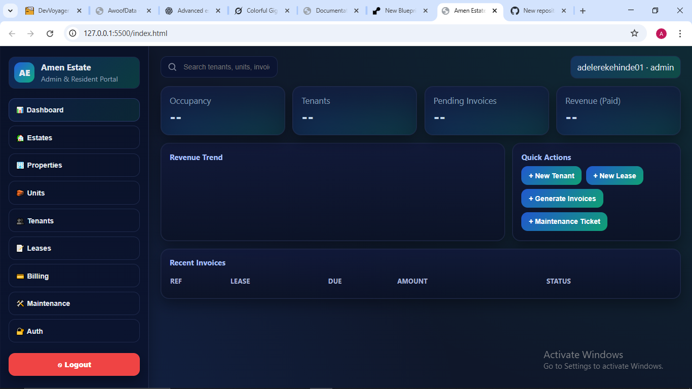
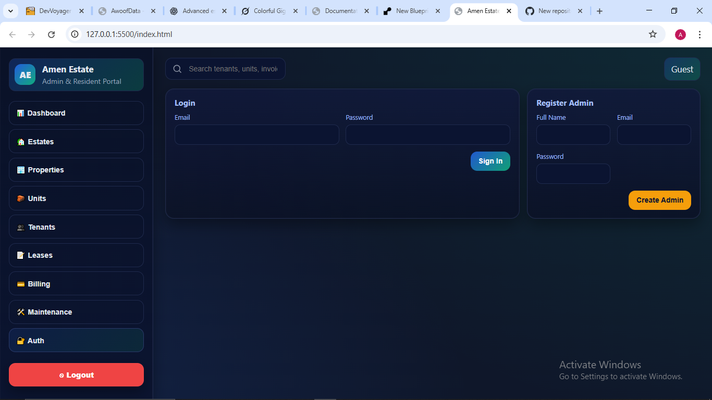

### Login Page

### Estate Management

# 🏘️ Amen Estate Management System  

Amen Estate is a **modern estate/property management system** built with **FastAPI (backend)** and **HTML/CSS/JavaScript (frontend)**.  
It allows administrators and managers to handle **estates, tenants, leases, invoices, and maintenance** in one place.  

---

## 🚀 Features  
- 🏡 Manage **estates, properties, and housing units**  
- 👨‍👩‍👧 Add & manage **tenants and leases**  
- 💳 Handle **invoices & payments**  
- 🛠️ Track **maintenance requests** and assign solutions  
- 📊 **Admin dashboard** with charts, KPIs, and reports  
- 🔑 Secure **JWT authentication & role-based access**  
- 🌐 **PostgreSQL** database (production-ready)  
- 🎨 Responsive **frontend with blue/green theme** and red logout button  

---

## 🛠️ Tech Stack  
- **Backend:** FastAPI, SQLAlchemy
- **Frontend:** HTML, CSS, JavaScript  
- **Deployment:** Render (Backend API + Frontend hosting)  

---

## 📂 Project Structure  
